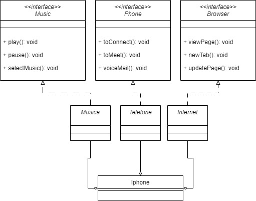

# interfacesIphone
## POO - Desafio

> Modelagem e diagramação da representação em UML e Código no que se refere ao componente iPhone das classes e interfaces com a proposta de representar os papéis de: Reprodutor Musicial, Aparelho Telefônico e Navegador na Internet.

Comportamentos esperados:
- Repodutor Musicial: tocar, pausar, selecionarMusica
- Aparelho Telefônico: ligar, atender, iniciarCorrerioVoz
- Navegador na Internet: exibirPagina, adicionarNovaAba, atualizarPagina

## Proposta de diagrama

